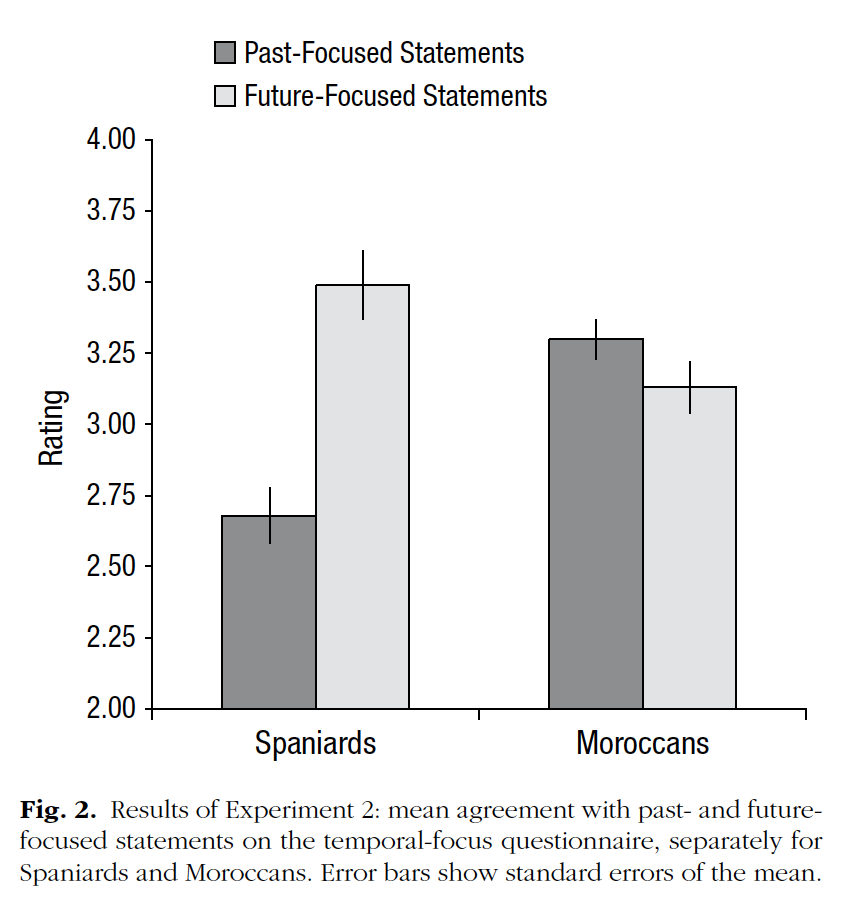

```{r}
articleID <- "3-9-2014_PS" # insert the article ID code here e.g., "10-3-2015_PS"
reportType <- 'final'
pilotNames <- "Katherine Hermann, Benjamin deMayo" # insert the pilot's name here e.g., "Tom Hardwicke". If there are multiple pilots enter both names in a character string e.g., "Tom Hardwicke, Bob Dylan"
copilotNames <- "Emily Hembacher" # insert the co-pilot's name here e.g., "Michael Frank". If there are multiple co-pilots enter both names in a character string e.g., "Tom Hardwicke, Bob Dylan"
pilotTTC <- 240 # insert the pilot's estimated time to complete (in minutes, fine to approximate) e.g., 120
copilotTTC <- 180 # insert the co- pilot's estimated time to complete (in minutes, fine to approximate) e.g., 120
pilotStartDate <- as.Date("11/04/17", format = "%m/%d/%y") # insert the pilot's start date in US format e.g., as.Date("01/25/18", format = "%m/%d/%y")
copilotStartDate <- as.Date("06/13/18", format = "%m/%d/%y") # insert the co-pilot's start date in US format e.g., as.Date("01/25/18", format = "%m/%d/%y")
completionDate <- as.Date("", format = "%m/%d/%y") # copilot insert the date of final report completion (after any necessary rounds of author assistance) in US format e.g., as.Date("01/25/18", format = "%m/%d/%y")
```

-------

#### Methods summary: 
This analysis pertains to Experiment 2 of de la Fuente et al. (2014). In that experiment, the researchers tested the question of whether temporal focus differs between Moroccan and Spanish cultures, hypothesizing that Moroccans are more past-focused, whereas Spaniards are more future-focused. Two groups of participants ($N = 40$ Moroccan and $N=40$ Spanish) completed a temporal-focus questionnaire that contained questions about past-focused ("PAST") and future-focused ("FUTURE") topics. In response to each question, participants provided a rating on a 5-point Likert scale on which lower scores indicated less agreement and higher scores indicated greater agreement. The authors then performed a mixed-design ANOVA with agreement score as the dependent variable, group (Moroccan or Spanish, between-subjects) as the fixed-effects factor, and temporal focus (past or future, within-subjects) as the random effects factor. In addition, the authors performed unpaired two-sample t-tests to determine whether there was a significant difference between the two groups in agreement scores for PAST questions, and whether there was a significant difference in scores for FUTURE questions.

------

#### Target outcomes: 

> According to a mixed analysis of variance (ANOVA) with group (Spanish vs. Moroccan) as a between-subjects factor and temporal focus (past vs. future) as a within-subjectS factor, temporal focus differed significantly between Spaniards and Moroccans, as indicated by a significant interaction of temporal focus and group, F(1, 78) = 19.12, p = .001, ηp2 = .20 (Fig. 2). Moroccans showed greater agreement with past-focused statements than Spaniards did, t(78) = 4.04, p = .001, and Spaniards showed greater agreement with future-focused statements than Moroccans did, t(78) = −3.32, p = .001. (de la Fuente et al., 2014, p. 1685).

------

```{r global_options, include=FALSE}
knitr::opts_chunk$set(echo=TRUE, warning=FALSE, message=FALSE)
```

## Step 1: Load packages

```{r}
library(tidyverse) # for data munging
library(knitr) # for kable table formating
library(haven) # import and export 'SPSS', 'Stata' and 'SAS' Files
library(readxl) # import excel files
library(CARPSreports) # custom report functions
library(afex) # anova functions
library(ez) # anova functions 2
library(scales) # for plotting
std.err <- function(x) sd(x)/sqrt(length(x)) # standard error
```

```{r}
# Prepare report object. This will be updated automatically by the reproCheck function each time values are compared.
reportObject <- data.frame(dummyRow = TRUE, reportedValue = NA, obtainedValue = NA, valueType = NA, percentageError = NA, comparisonOutcome = NA, eyeballCheck = NA)
```

## Step 2: Load data

The data posted on OSF had two typos in the "participant" column, which apparently were not present in the data used to conduct analyses for the paper. Due to these typos, it appeared that 2 participants were missing data for one of the levels of the comparison variable, and were thus dropped from the ANOVA and t-tests that we originally conducted. Once we fixed this problem, the degrees of freedom reported in the paper matched our analyses. 

```{r}
#data_path <- 'data/DeLaFuenteEtAl_2014_RawData.xls'

data_path <- 'data/DeLaFuenteEtAl_2014_RawData-OSF-corrected_EHedit.xls' 
#note that I had to add an extra correction to the corrected file the authors sent- they fixed one of the typos they described in the email but not the other

d <- read_excel(data_path, sheet=3)
```

## Step 3: Tidy data

```{r}
# rename agreement
colnames(d)[5] <- 'agreement'

# change variable formats 
d$group <- factor(d$group)
d$participant <- d$participant
d$subscale <- factor(d$subscale) # "subscale" is the temporal focus
d$item <- factor(d$item)
d$agreement <- as.integer(d$agreement)

#rename participants so that identifiers are distinct in the two groups
moroccan_ids = d$participant[d$group=='Moroccan']
d$participant[d$group=='young Spaniard'] = d$participant[d$group=='young Spaniard'] + tail(moroccan_ids, 1)
d$participant <- factor(d$participant)

# view
head(d)
```

## Step 4: Run analysis

### Pre-processing

```{r}
# aggregate the data at the participant level
#   - collapse agreement scores for items within each level of subscale into a single (mean) value
d_agg <- d %>% 
  group_by(group, participant, subscale) %>% 
  summarise(agreement_score = mean(agreement))
```

### Descriptive statistics

Try to recreate Figure 2:



```{r}
descript <- d_agg %>% 
  ungroup() %>%
  mutate(group = factor(group, levels = c("young Spaniard", "Moroccan")),
         subscale = factor(subscale, levels = c("PAST", "FUTURE"))) %>%
  group_by(group, subscale) %>% 
  summarise(mean_rating = mean(agreement_score), se = std.err(agreement_score)) 

descript %>%
  ggplot(aes(x = group, y = mean_rating, ymin = mean_rating - se, ymax = mean_rating + se, fill = subscale, group = subscale)) +
  theme_minimal() +
  geom_bar(position=position_dodge(), stat="identity") +
  geom_errorbar(position = position_dodge()) +
  scale_y_continuous(limits=c(2,4), oob = rescale_none)
```

Looks at least approximately correct.

```{r}
reportObject <- reproCheck(reportedValue = "figure", obtainedValue = filter(descript, group == "young Spaniard", subscale == "PAST") %>% pull(mean_rating), valueType = 'mean', eyeballCheck = TRUE)

reportObject <- reproCheck(reportedValue = "figure", obtainedValue = filter(descript, group == "young Spaniard", subscale == "PAST") %>% pull(mean_rating), valueType = 'se', eyeballCheck = TRUE)

reportObject <- reproCheck(reportedValue = "figure", obtainedValue = filter(descript, group == "young Spaniard", subscale == "FUTURE") %>% pull(mean_rating), valueType = 'mean', eyeballCheck = TRUE)

reportObject <- reproCheck(reportedValue = "figure", obtainedValue = filter(descript, group == "young Spaniard", subscale == "FUTURE") %>% pull(mean_rating), valueType = 'se', eyeballCheck = TRUE)

reportObject <- reproCheck(reportedValue = "figure", obtainedValue = filter(descript, group == "Moroccan", subscale == "PAST") %>% pull(mean_rating), valueType = 'mean', eyeballCheck = TRUE)

reportObject <- reproCheck(reportedValue = "figure", obtainedValue = filter(descript, group == "Moroccan", subscale == "PAST") %>% pull(mean_rating), valueType = 'se', eyeballCheck = TRUE)

reportObject <- reproCheck(reportedValue = "figure", obtainedValue = filter(descript, group == "Moroccan", subscale == "FUTURE") %>% pull(mean_rating), valueType = 'mean', eyeballCheck = TRUE)

reportObject <- reproCheck(reportedValue = "figure", obtainedValue = filter(descript, group == "Moroccan", subscale == "FUTURE") %>% pull(mean_rating), valueType = 'se', eyeballCheck = TRUE)
```


### Inferential statistics

In this section we will check the reproducibility of the results of Experiment 2, described as follows:

> According to a mixed analysis of variance (ANOVA) with group (Spanish vs. Moroccan) as a between-subjects factor and temporal focus (past vs. future) as a within-subjects factor, temporal focus differed significantly between Spaniards and Moroccans, as indicated by a significant interaction of temporal focus and group, F(1, 78) = 19.12, p = .001, ηp2 = .20 (Fig. 2).

```{r}
# ANALYSIS 1: Mixed-design ANOVA with group as between-subjects variable (fixed effect) and subscale as within-subjects variable (random effect), with partial eta-squared's
aov_group_subscale <- aov_car(agreement_score ~ group*subscale + Error(participant/subscale), data=d_agg, anova_table=list(es="pes"), type = "III")
summary(aov_group_subscale) # detailed print-out
print(aov_group_subscale) # truncated output but includes partial eta-squared's
```


```{r}
df_group_subscale <- aov_group_subscale$anova_table$`den Df`[3]
F_group_subscale <- aov_group_subscale$anova_table$F[3]
p_group_subscale <- aov_group_subscale$anova_table$`Pr(>F)`[3]
pes_group_subscale <- aov_group_subscale$anova_table$pes[3]

reportObject <- reproCheck(reportedValue = "78", obtainedValue = df_group_subscale, valueType = 'df')
reportObject <- reproCheck(reportedValue = "19.12", obtainedValue = F_group_subscale, valueType = 'F') # group:subscale F
reportObject <- reproCheck(reportedValue = ".001", obtainedValue = p_group_subscale, valueType = 'p') # group:subscale p
reportObject <- reproCheck(reportedValue = ".20", obtainedValue = pes_group_subscale, valueType = 'pes') # partial eta-squared
```

> Moroccans showed greater agreement with past-focused statements than Spaniards did, t(78) = 4.04, p = .001, 

```{r}
moroccan_past <- d_agg %>% filter(subscale=='PAST', group=='Moroccan')
spanish_past <- d_agg %>% filter(subscale=='PAST', group=='young Spaniard')

t_past <- t.test(moroccan_past$agreement_score, spanish_past$agreement_score, paired=FALSE, var.equal=TRUE) # two-tailed Student's 

df_ttest_past <- unname(t_past$parameter)
t_ttest_past <- unname(t_past$statistic)
p_ttest_past <- unname(t_past$p.value)

# compare reported with two-tailed Student's result
reportObject <- reproCheck(reportedValue = "78", obtainedValue = df_ttest_past, valueType = 'df') # df
reportObject <- reproCheck(reportedValue = "4.04", obtainedValue = t_ttest_past, valueType = 't') # t-statistic
reportObject <- reproCheck(reportedValue = ".001", obtainedValue = p_ttest_past, valueType = 'p') # p
```

> and Spaniards showed greater agreement with future-focused statements than Moroccans did, t(78) = −3.32, p = .001.(de la Fuente et al., 2014, p. 1685)

```{r}
moroccan_future <- d_agg %>% filter(subscale=='FUTURE', group=='Moroccan')
spanish_future <- d_agg %>% filter(subscale=='FUTURE', group=='young Spaniard')

t_future <- t.test(moroccan_future$agreement_score, spanish_future$agreement_score, paired=FALSE, var.equal=TRUE) # two-tailed Student's 

df_ttest_future <- unname(t_future$parameter)
t_ttest_future <- unname(t_future$statistic)
p_ttest_future <- unname(t_future$p.value)

# compare reported with two-tailed Student's result
reportObject <- reproCheck(reportedValue = "78", obtainedValue = df_ttest_future, valueType = 'df') # df
reportObject <- reproCheck(reportedValue = "-3.32", obtainedValue = t_ttest_future, valueType = 't') # t-statistic
reportObject <- reproCheck(reportedValue = ".001", obtainedValue = p_ttest_future, valueType = 'p') # p
```

## Step 5: Conclusion

We could not reproduce some reported values.

On the first pass, for the ANOVA, we noted that two participants (participant 25 for both the Moroccan and Spaniard samples) had missing data for the PAST condition. The degrees of freedom reported in the paper appeared to reflect that the participants *were* included in this analysis. When we followed up with the authors, they clarified that there were typos in the data file they had posted on OSF. The wrong participant ID had been added for some lines of data, making it appear that two participants were missing data. Once we corrected the typo, the degrees of freedom in our analyses matched those in the paper. 

There were two major errors with p-values where the authors reported that p = .001, but the true rounded values of p were 0.00. The authors noted that it is their policy to round up to p = .001 when p values are less than .001. 

```{r}
Author_Assistance = TRUE # was author assistance provided? (if so, enter TRUE)

Insufficient_Information_Errors <- 0 # how many discrete insufficient information issues did you encounter?

# Assess the causal locus (discrete reproducibility issues) of any reproducibility errors. Note that there doesn't necessarily have to be a one-to-one correspondance between discrete reproducibility issues and reproducibility errors. For example, it could be that the original article neglects to mention that a Greenhouse-Geisser correct was applied to ANOVA outcomes. This might result in multiple reproducibility errors, but there is a single causal locus (discrete reproducibility issue).

locus_typo <- NA # how many discrete issues did you encounter that related to typographical errors?
locus_specification <- NA # how many discrete issues did you encounter that related to incomplete, incorrect, or unclear specification of the original analyses?
locus_analysis <- NA # how many discrete issues did you encounter that related to errors in the authors' original analyses?
locus_data <- NA # how many discrete issues did you encounter that related to errors in the data files shared by the authors?
locus_unidentified <- NA # how many discrete issues were there for which you could not identify the cause

Affects_Conclusion <- FALSE # Do any reproducibility issues encounter appear to affect the conclusions made in the original article? This is a subjective judgement, but you should taking into account multiple factors, such as the presence/absence of decision errors, the number of target outcomes that could not be reproduced, the type of outcomes that could or could not be reproduced, the difference in magnitude of effect sizes, and the predictions of the specific hypothesis under scrutiny.
```

```{r}
reportObject <- reportObject %>%
  filter(dummyRow == FALSE) %>% # remove the dummy row
  select(-dummyRow) %>% # remove dummy row designation
  mutate(articleID = articleID) %>% # add the articleID 
  select(articleID, everything()) # make articleID first column

# decide on final outcome
if(any(reportObject$comparisonOutcome != "MATCH") | Insufficient_Information_Errors > 0){
  finalOutcome <- "Failure without author assistance"
  if(Author_Assistance == T){
    finalOutcome <- "Failure despite author assistance"
  }
}else{
  finalOutcome <- "Success without author assistance"
  if(Author_Assistance == T){
    finalOutcome <- "Success with author assistance"
  }
}

# collate report extra details
reportExtras <- data.frame(articleID, pilotNames, copilotNames, pilotTTC, copilotTTC, pilotStartDate, copilotStartDate, completionDate, Author_Assistance, finalOutcome, Insufficient_Information_Errors, locus_typo, locus_specification, locus_analysis, locus_data, locus_unidentified)

# save report objects
if(reportType == "pilot"){
  write_csv(reportObject, "pilotReportDetailed.csv")
  write_csv(reportExtras, "pilotReportExtras.csv")
}

if(reportType == "final"){
  write_csv(reportObject, "finalReportDetailed.csv")
  write_csv(reportExtras, "finalReportExtras.csv")
}
```

# Session information

```{r session_info, include=TRUE, echo=TRUE, results='markup'}
devtools::session_info()
```
